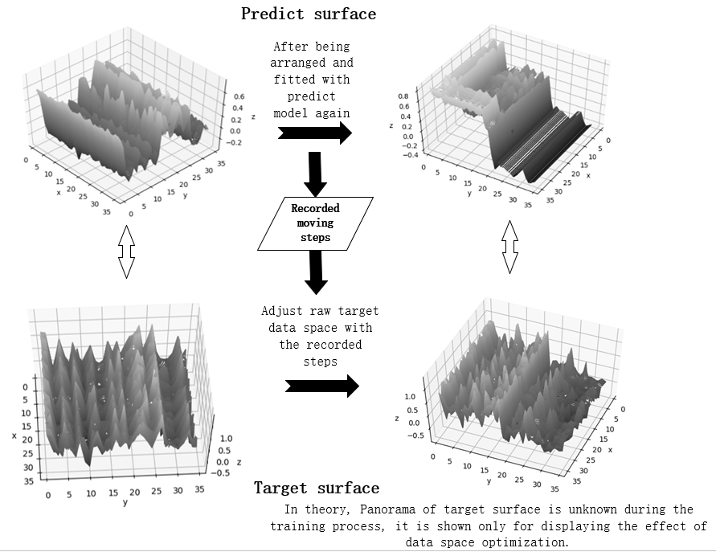
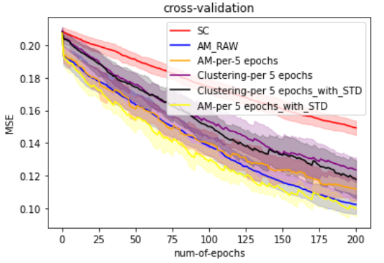
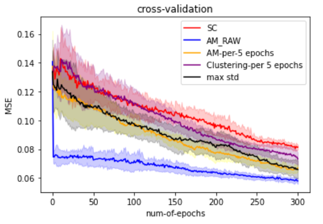

# Introduction of the project
Code as souvenior as summer camp in Carnegie Mellon University online.
Published as my first conference paper: "A recessive active learning method: enhancing the performance of predict models by adjusting the structure of data space", Proc. SPIE 12087, International Conference on Electronic Information Engineering and Computer Technology (EIECT 2021), 120871W (13 December 2021).

  

  

  

## Code introduction
1. main.py
This py document serves as final cross-validation of different active learning methods on Gaussian process model, because the cross-validation is more stable for its high iteration times, hence I set it as main.py so that we could get more reliable and stable active learning effects.
In the main.py, I set 4 counterparts--raw matrix, AM on raw matrix, AM per 5 epochs, Clustering movement per 5 epochs. The last two methods are all recessive active learning ways I mention in my paper. 

2. function.py
In this py file, it writes the clustering adjustment method and other assist functions.

3. BO3.py
This function could be used to go through a whole turn by comparing random sampling method and other active learning methods in Guassian process model.

4. Random-forest-4-trial
This function could be used to go through a whole turn by comparing random sampling method and other active learning methods in Random forest model.

5. CV_RF.py
This py documment serves as cross-validation on random-forest regressor, the running time on this py document could be quite long, especially when it tests with postive active learning method in my paper. The acquistion function would ask for all trees in random forest and calculate the diversity of their output, which need a lot of time.

6. one-dimension-test.py
This file exhibits the effect of my methodology on simple 1-D situations.

7.the rest document are some middle file which are used to check the process and the effect of code when I am training model.

8. datasets
The file contains the datasets of this trial, ".\datasets\LDS-1518\Data\20343.csv".

More files might be made up in future ；）
If you meet some questions or have some advice, please do email me through 2242469978@qq.com! I will be appreciate if you could talk to me.

Author: Sun Weiyu